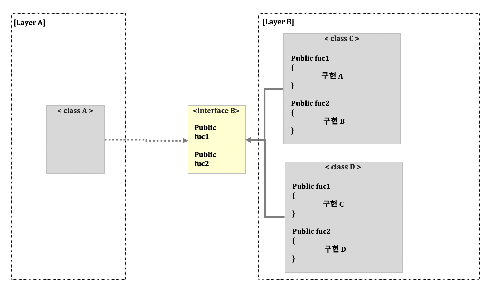

# 3장 마이크로서비스 애플리케이션 아키텍처

> 소프트웨어의 가치는 행위 가치와 구조 가치로 나뉘고, 소프트웨어를 정말로 부드럽게 만드는 것은 구조 가치다 - <<클린 아키텍처>>

- 행위 가치 : 소프트웨어의 기능을 말한다
- 구조 가치 : 소프트웨어 아키텍처를 말한다.

기능구현에만 초점을 맞춘 소프트웨어는 전혀 소프트하지 않다. 아키텍처가 좋은 소프트웨어가 진짜 소프트한 소프트웨어다.

유연한 소프트웨어는 지속적 비즈니스의 변화에 대응을 할 수 있고, 기민하게 대응할 수 있게 한다 = 마이크로서비스 아키텍처의 장점.

**챕터의 흐름**
1. 국내 많이 발생하는 소프트웨어 아키텍처의 문제점을 살펴보고,
2. 바람직한 애플리케이션 아키텍처 아이디어를 알아본 후, 아이디어가 마이크로서비스와 어떻게 접목 되는지 살펴보고,
3. 마이크로 서비스 내부 설계시 고려해야할 각종 애플리케이션 패턴을 살펴보자.

---

## 1. 비즈니스 로직은 어디에? - 관심사의 분리
***비즈니스 로직***
- 소프트웨어의 핵심이라고 많이 말한다.
- 보통 비즈니스 영역의 업무 규칙, 흐름, 개념을 포현하는 용어다.
- 개발자의 역할은, 비즈니스 로직을 분석 및 이해하고, 프로그래밍 언어란 도구로 잘 표현하는 일이다.
    - = 업무규칙, 흐름, 개념을 이해하기 쉽고 변경 하기 쉬운 코드를 작성하는 일이라고 할 수 있다.

***관심사 분리(seperation of concerns)***
- 관심이란 소프트웨어의 기능이나 목적을 의미한다.
- 관심을 분리한다는 것은, 관심과 관련된 코드를 모아 독립적인 모듈로 만들어, 영향을 덜 받게 하는 것이다.
- 즉, 시스템의 각 영역이 처리하는 관심사가 분리되어 서로 영향을 덜 받기 때문에 관리하기 편함을 의미한다.
- 이 원칙은 시스템을 이해하고 변경하기 쉽게 만들어 준다.
- 모듈화 및 계층화도 관심사 분리 원칙에 기인한다.

**비즈니스로직과 기술영역은 철저하게 분리하는 것이 좋다.** = 비즈니스와 기술의 관심영역은 다르다.

    - 🤚 simple 사례: 쇼핑하기 개념에서 다같이 생각해보자 ( ex. 상품 검색.. 상품 검색 조건은 비즈니스.. 클라이언트 호출은 기술..?)
    - 🤚 헥사고날 아키텍처/ 클린 아키텍처에서 비즈니스로직과 기술영역이 아키텍처 구조로 인해 분리되는지 생각해보기
- 기술과 비즈니스 로직을 분리 했을 때 복잡석이 낮아지고 유지 보수성도 높아진다.
- 객체지향 분석설계에서는 비즈니스 로직을 누가 봐도 이해하기 쉽게 구조화하는 객체 모델로 표현하는 것을 강조했다. 
    - OOAD: Object Oriented Analysis and Design

### 국내 소프트웨어 업계의 모습

유행의 종류

**MDD**
- 개발 생산성 강화라는 그럴듯한 명목에 설계모델을 기반으로 MDD 유행이 있엇다 
    - Model Driven Development: 플랫폼 독립 모델을 플랫폼 상세 모델로 변경하는 과정에서 순수 분석 모델에 특정 플랫폼의 기술을 붙여서 만든다. 
    - 이러한 코드는 매우 복잡하고, 특정 기술에 종속적일 수 밖에 없다. 업무를 이해하려면 리버스 엔지니어링을 통해 코드를 모델로 변환해서 검토해야하고, 비즈니스 변경을 위해 모델을 수정한 후 다시 코드로 생성하는 과정을 거쳐야 하는 번거로음이 있따.
    - 우리나라 금융권에서 사용되던 방식인듯. 배경은 기술의 복잡화(상호 운영성 결여, 소프트웨어 개발 어려움, 이식성 부족), 서비스환경의 다양화, 기술의 급격한 변화 등이 있다고 한다.
    
**전자정부표준** 
- 정부 주도하 정보화 사업에 사용하기 위해 오픈소스 기술을 활용해 만든 정부 주도 프레임 워크
- 순수한 자바 객체(POJO) 지향하는 스프링 기반으로 만들었는데
- 사실상 객체지향을 그렇게 중요하게 고려하고 있지 않다.
- 모든 비즈니스가 데이터 질의 구문인 SQL에 지향되는 개발을 하게 된다
- 비즈니스로직이 SQL에 중심이 되어있고, 서비스코드는 흐름제어만 헤게된다.
- DB가 병목이 되어 지속적 개발이 어려워 지는 이슈가 있다.

### 3.1 데이터베이스 중심 아키텍처의 문제점
**데이터베이스 중심 아키텍처**
- 관계형 데이터베이스에 의존한 데이터 모델링을 수행한 다음, 물리 테이블 모델을 중심에 두고 애플리케이션을 구현하기 위한 사고를 하는 방식.
- ex. 컨트롤러/ 서비스 / 레퍼지토리(DB IO), DTO, SQL 매퍼를 사용함.
- 서비스는 제어흐름만 하게되고, SQL 질의에 비즈니스가 의지된다.
- `트랜잭션 스크립트` 구조와 비슷하다.
    - 서비스에서 절차적으로 비즈니스 호출, 모델은 데이터 저장소로써의 역할만 수행.

단점
1. 데이터베이스 중심 아키텍처에서는 저장소를 바꾸고 싶어도 쉽게 변경할 수 없다. 비즈니스로직과 저장기술이 끈끈하게 붙어있기 떄문이다.
2. 대부분의 성능을 데이터베이스에 의존한다. 데이터가 늘어남에 따라 성능은 지속적으로 떨어지고 최족화 방법으로는 스케일업/ 쿼리튜닝이다.
3. 클라우드 시대에서는 인프라를 유연하게 이용할 수 있고, 선택지가 다양한데 관계형 db만 고려할 방법은 문제해결에 적절치 않다.

---

## 2. 헥사고날 아키텍처와 클린 아키텍처
- 전통적인 레이어드 아키텍처
- 최근 헥사고날 아키텍처
- 클린아키텍처

### 2.1. 레이어드 아키텍처
- 논리적으로 3계층 으로 나누어 구성 (presentation , business logic, data access) -> 컨트롤러, 서비스, 레퍼지토리
- 레이어드 아키텍처의 규칙
    - 상위 계층이 하위계층을 호출하는 단방향성 유지
    - 상위 계층은 하위 계층 바로 밑 계층만 활용 ( 프레젠테이션 -> 서비스 / 서비스 -> 데이터 O, 프레젠테이선 -> 데이터 X)
    - **상위 계층이 하위 계층에 영향을 받지 않게 구성**
    - 하위 계층은 상위 계층을 알지 못하게 구성.
    - 인터페이스를 통해 호출함이 바람직함 -> 다형성을 추구함.

- 인터페이스를 통한 접근은 DIP를 만족하는 것 처럼 보이지만,
- `OCP는 만족하지 못한다.` ( OCP - Open Close Principal). 확장에는 열려있고 변화엔 닫쳐 있어야 한다.
- OCP에 위반되는 까닭은 **모든 계층이 자신이 제공하는 기능에 대한 추상 인터페이스를 직접 정의하고 소유하고 있는 구조기 때문이다**
    - = 상위 계층이 하위 계층에 영향을 받지 않게 구성함이라는 규칙에 어긋난다.
- 코드의 흐름이 상-> 하로 흐른다. 그래서 제어 흐름대로 의존성 방향이 따른다.
- 상위 계층이 하위계층에서 정의한 특성에 영향을 받게 된다.
- 구현체 클래스가 변경된 경우 상위 클래스가 영향을 받지는 않겠지만, 인터페이스가 변경되게 되면 비즈니스 로직 클래스가 엑세스 계층에 의존되기 때문에 변경에 영향을 받는다.

***레이어 엑세스 인터페이스의 위치가 문제다***

- 데이터 엑세스 레이어에서 정의한 인터페이스를, 비즈니스 로직 계층으로 옮긴다.
    - = 데이터 엑세스 계층에 구현해야 할 인터페이스를, 고수준의 비즈니스 로직에서 정의함으로써, 의존방향을 역전시켜 저수준 영역에서 영향 받지 않도록 하는 것이다.
    
### 2.2. 헥사고날 아키텍처
- 레이어드 아키텍처에 DIP를 적용해도 한계가 있다. 현대 애플리케이션에서는 다양한 인터페이스를 필요로 한다
    - = 애플리케이션과 상호작용 하는 다양한 저장소가 존재한다. 다방면으로 열려있는 아키텍처로 문제해결이 필요하다.
- 헥사고날 아키텍처 = **포트 앤드 어댑터** 아키텍처 라고도 한다.

- 내부영역
    - 고수준 비즈니스 로직을 포현함
    - 외부영역과 연계되는 포트를 가지고 있다.(인바운드포트/아웃바운드포트)
        - 인바운드 포트: 내부 영역의 사용을 위해 표출된 API이고, 외부영역의 인바운드 어댑터가 호출함
        - 아웃바운드 포트 : 내부영역이 외부를 호출하는 방법을 정의하고, 아웃바운드 어댑터가 아웃바운드 포트에 의해 구현됨.
- 외부영역
    - 저수준의 외부영역을 담당
    - 외부에서 들어오는 요청을 처리하는 인바운드 어댑터
        - e.g. 스프링 MVC 컨트롤러, 커맨드 핸들러, 메세지 구독 핸들러
    - 비즈니스 로직에 의해 호출되어 외부와 연계되는 아웃바운드 어댑터로 구성된다.
        - e.g. DAO, 메세지 발행 클래스, 외부 서비스 호출 프록시

### 2.3. 클린 아키텍처

- 헥사고날 아키택처의 아이디어와 매우 비슷하다.
- 구조가치( 소프트웨어 아키텍처 )를 부드럽게 유지하는 방법이 무었일까? 
    - 구조 중, 선택할 수 있는 것을 가능한 오랬동안 `열어 두는 것이고(?)`. 열어둬야할 사항은 중요하지 않은 세부사항 이다.
    - ⁉️ 선택할 수 있는 것은, 기술이나 프레임워크,저장소,같이 변경 가능한 것들.. 선택할 수 없는건 핵심 비즈니스 로직..?
- 클린아키텍처에서는 중앙에서부터 엔티티, 유스케이스, 세부사항으로 구분한다
    - 엔티티 (비즈니스 업무 규칙) 특징
        - 수동으로 처리할 수 있지만, 시스템으로도 자동화 할 수 있는 것.
        - e.g. 쇼핑몰 물건을 사고파는 규칙, 은행이자 계산, 대출/.반납 등
        - 본질적으로 데이터와 결합돼 있어, 객체로 쉽게 만들 수 있고 테스트 할 수 있는 객체들
    - 유스케이스 특징
        - 애플리케이션 특화된 업무규칙을 표현하며, 핵심 업무규칙을 호출하고 제어한다
        - 엔티티는 유스케이스를 알면 안된다. 간단한 객체여야 한다. 프레임워크 데이터베이스등에 의존해서는 안된다. 유스케이스 객체를 통해서만 조작해야 한다.
    - 세부사항 특징
        - 세부사항은 유스케이스를 감싸고 있는 모든 영역을 말한다 (입출력 장치, 저장소, 웹 시스템, 서버, 프레임워크, 통신 프로토콜)
        - 세부사항과 유스케이스의 관계를 DIP를 이용해 플러그인 처럼 유연하게 처리해야 한다.

---
## 3. 마이크로서비스의 내부 구조 정의

### 3.1. 바람직한 마이크로 서비스 내부 아키텍처: 클린 마이크로서비스

세가지 아키텍쳐(레이어드, 헥사고날, 클린)의 지향하는 바를 통해 클린마이크로서비스의 구조를 정의해보면, 앞의 원칙들을 정리할 필요가 있다.

1. 지향하는 관심사에 따라 `응집성을 높이고`, 관심사가 다른 영역은 `의존성을 낮추게` 해야한다.
2. 업무 규칙을 정의하는 `비즈니스 로직 영역을 다른 기술 기반 영역으로부터 분리`하기 위해 노력한다.
3. 세부기술 중심, 저수준의 `외부영역` /  핵심업무 규칙이 정의된 구수준의 `내부영역`으로 분리
4. 고수준 영역은 저수준 영역에 의존하지 않게 하며, 저수준 영역이 고수준 영역에 의존하게 해야한다.
5. 저수준 영역은 언제든지 교체, 확장 가능해야 하며. 이 같은 변화가 고수준 영역에 영향을 줘선 안된다.
6. 자바처럼 인터페이스&추상클래스를 지원하는 언어의 경우 저수준 영역의 구체 클래스가 고수준 영역의 추상 인터페이스에 의존하게 하는 의존성 역전 원칙을 적용한다.
7. `인터페이스는 고수준의 안정된 영역에 존재`해야하며, 저수준의 어댑터가 이를 구현한다.

### 3.2. 내부영역 - 업무 규칙

서비스 구현체, 서비스인터페이스(IF), 도메인, 레퍼지토리 IF, 이벤트 IF, 프록시 IF 존재
- 서비스 IF : 외부 영역에 내부를 감추도록 함, 클라이언트의 사용 편의성도 높여줌 ( mock )
- 레포,이벤트,프록시 IF : DIP 원칙을 지원함. 저수준의 외부 어댑터가 인터페이스를 구현하게함.
- 서비스와 도메인 : 클린 아키텍처의 유스케이스, 엔티티 역할을 한다. 도메인은 비즈니스 계증을 표현, 서비스는 도메인을 활용해 시스템 흐름 처리한다.
    - 서비스는 유스케이스를 처리하는 애플리케이션 서비스에 가깝다 ( 도메인의 활동이나 행위를 처리하는 서비스 X )

***트랜잭션 스크립트 패턴 ( - 서비스와 도메인 관계를 구현할 때 참고할 만한 패턴 )***

- 도메인 객체가 행위를 가지고 있지 않고, 무언가를 수행하는 책임은 서비스가 가지고 있다.
- 도메인은 객체 정보의 묶음으로써의 역할이 가깝다.
- 서비스가 유스케이스 처리 단위이고, 때문에 중복되는 코드가 계속 생겨날 수 있다. ( 쇼핑하기.. 전시 로직 같다요..)
- 절차지향식 프로그래밍과 방법이 같기 때문에, 비즈니스에 쉽게 적용할 수 있다.
- 간단한 비즈니스를 처리할 때 도움이 된다.

***도메인 모델 패턴***

- 도메인이 객체 데이터 뿐 아니라 행위를 가지고 있고, 도메인 객체가 소유한 데이터는 도메인 객체가 제공하는 행위에 의해 은닉된다.
- 서비스는 비즈니스 유스케이스를 구현하기 위해 서비스 행위의 일부를 도메인에 위임해 처리한다.
- 도메인 모델은 객체지향 설계의 객체모델이다.
- 더 진화해서 애그리거트 패턴을 적용할 수 있다.
- 복잡한 로직이 많은 마이크로서비스의 구조로 선택하는 것이 좋다.

***도메인 주도 설계의 애그리거트 패턴***

- 애그리거트: **개념적으로 묶인 엔티티의 모음 전체를 지칭한다.**
- 객체 모델링의 `단점`을 보완한 패턴이다
    - 도메인 모델링의 객체간 관계를 객체 참조로 표현하는데, 비즈니스가 복잡해 질 수록 다단계 계층구조가 생기고 복잡한 관계가 발생하고, 무거워진다.
    - 도메인 내부의 경계를 불명확 하다.
    - 도메인 모델 패턴의 문제를 해결하기 위해, 최상위에 존재하는 엔티티를 중심으로 개념의 집합을 분리한다.
- 애그리거트 패턴은 다음과 같은 규칙을 부여한다.
    - 애그리거트 루트만 참조한다.
    - 애그리거트 내 상세 클래스를 바로 참조하지 않고, 루트를 통해 참조해야 한다.
    - 애그리거트 간의 참조는 객체를 직접 참조하는 대신 기본 키를 사용한다.
    - 깁노키를 사용하면 느슨하게 연관되고, 수정이 필요하지 않은 애그리거트를 함꼐 수정하는 실수를 방지한다.
    - `하나의 트랜잭션으로 하나의 애그리거트만 생성, 수정한다.`
        - 애그리 거트 패턴에서, 여러 도메인을 수정해야 한다면, 비동기로 처리하나..!? 다른 트랜잭션의 역할 이니까..

### 3.3. 외부영역
API 퍼블리싱 어댑터, API 프락시 어댑터, 도메인 이벤트 발행 어댑터, 저장소 처리 어댑터, 도메인 이벤트 핸들러
- 내부영역의 서비스 IF를 사용하는 인바운드 어댑터와 내부영역에서 선언한 아웃바운드 IF를 구현하는 다양한 어댑터로 구성한다.
- 어댑터는 플러그인 처럼 교체되거나 확장될 수 있어야 한다.
- 내부영역이 먼저 정의된 후에 외부 영역의 세부사항은 늦게 정의되도 상관 없도록 해야한다.

`API퍼블리싱 어댑터`
- REST API를 발행하는 인바운드 어댑터. 서비스 인터페이스를 호출해 REST 형식의 API를 제공한다
- rest 리소스 명청을 정의, 올바른 인터페이스 호출, **응답 DTO 변환 및 매핑해 전달함**
    - controller

`API 프락시 어댑터`
- 아웃바운드 어댑터
- 내부 영역에서 정의된 프락시 인터페이스를 구현, 다른 API를 호출하거나 soap(simple object access protocol - http,smtp...) 사용

`저장소 처리 어댑터`
- 아웃바운드 어댑터 구현. 데이터 처리 메커니즘을 선택할 필요가 있다.
- ORM 또는 sql mapper 사용. 

`도메인 이벤트 발행 어댑터`
- 어떤 사전에 따른 상태의 변경 사항을 말함. 컨슈머에게 전달되기 위해 도메인 이벤트 발행 어댑터를 통해 제공한다.
- 애그리거트 패턴을 적용할 경우, **애그리거트에서 발생한 사건이 된다.**
    - 도메인 이벤트를 빠르게 파악하려면 코드의 어느부분을 바라보는게 맞을까..?
- 도메인 이벤트가 생성되는 위치는 내부영역, 도메인 이벤트 발행 어댑터는 내부영역의 이벤트 IF를 구현해 아웃바운드로 특정 메세지 큐나 스트림 저장소에 발행하는 역할을 수행한다.

`도메인 이벤트 핸들러`
- 도메인 이벤트를 수신할 수 있는 인바운드 어댑터
- 외부에서 발행된 도메인 이벤트를 구독해서 내부 영역으로 전달하는 일을 수행한다.

## 4. 정리